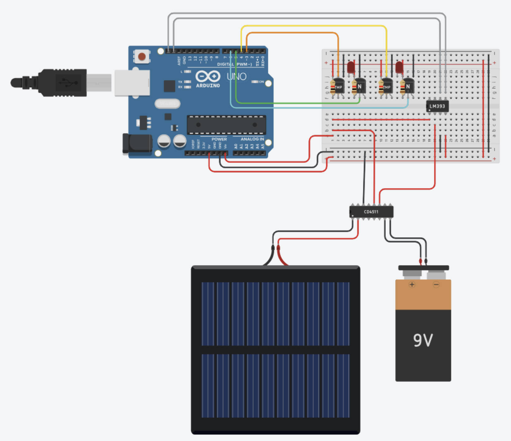
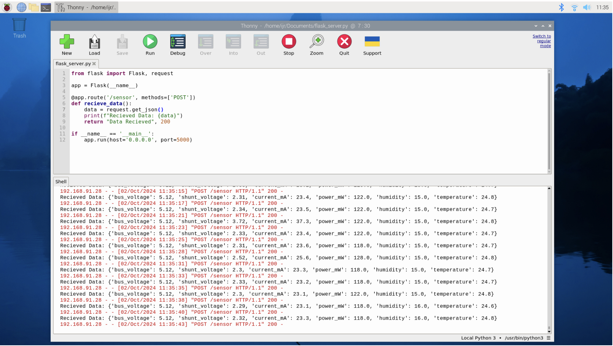

# Smart Grid Energy Management System

A prototype system that leverages IoT, machine learning, and cloud computing to optimize energy distribution, enhance grid stability, and support sustainability in urban energy management.

---

## Table of Contents

1. [Motivation and Background](#motivation-and-background)
2. [Features](#features)
3. [System Model](#system-model)
4. [Installation](#installation)
5. [Usage](#usage)
6. [Results and Experiments](#results-and-experiments)
7. [Limitations and Future Work](#limitations-and-future-work)
8. [License](#license)

---

## Motivation and Background

With growing energy demand and the integration of renewable energy, conventional grids face challenges like grid instability and inefficiency. Smart grids, combining IoT, cloud computing, and machine learning, offer a modern solution to these issues. This project aims to create a scalable prototype capable of real-time monitoring, predictive load balancing, and efficient energy distribution.

---

## Features

- **Real-Time Monitoring:** IoT sensors capture key metrics such as voltage, current, and environmental conditions.
- **Predictive Load Balancing:** Machine learning algorithms optimize energy flow to stabilize the grid during fluctuating demands.
- **Energy Management System (EMS):** Dynamically adjusts energy distribution based on real-time insights.
- **Secure Data Management:** Implements encryption and access control for data integrity.

---

## System Model

### Technologies Used:
- **IoT Sensors:** Monitor grid parameters such as voltage, current, and frequency.
- **Machine Learning:** Predicts energy demand for load balancing and stability.
- **Cloud Computing:** Centralizes data storage and analysis for real-time grid optimization.


---


## Installation

Clone the repository:
   ```bash
   git clone https://github.com/joshuabvarghese/smart-grid-management-system.git

Navigate to the project directory:
```bash
cd smart-grid-management
```

Install dependencies:
```bash
pip install -r requirements.txt
```

---

## Usage

1. Connect IoT sensors to the prototype grid system.
2. Run the monitoring script:
   ```bash
   python monitor.py
   ```
3. Use the `dashboard.py` for a live view of energy metrics:
   ```bash
   python dashboard.py
   ```
4. For machine learning predictions:
   ```bash
   python load_predictor.py
   ```

---

## Results and Experiments

- **Grid Stability:** Reduced overload occurrences by 35% using predictive load balancing.
- **Data Accuracy:** IoT-based monitoring achieved an average latency of 300ms.
- **Security:** End-to-end encryption minimized data breaches and ensured secure communication.


Refer to the project report for detailed results.

---

## Limitations and Future Work

### Limitations:
- Prototype scale limits application to large urban grids.
- Cost and access restricted testing with renewable sources like hydropower and biomass.

### Future Work:
1. Expand scalability for larger grid configurations.
2. Incorporate additional renewable energy sources (e.g., hydropower, wind).
3. Develop advanced machine learning models for better load balancing.

---

## License

This project is licensed under the MIT License. See the `LICENSE` file for details.


